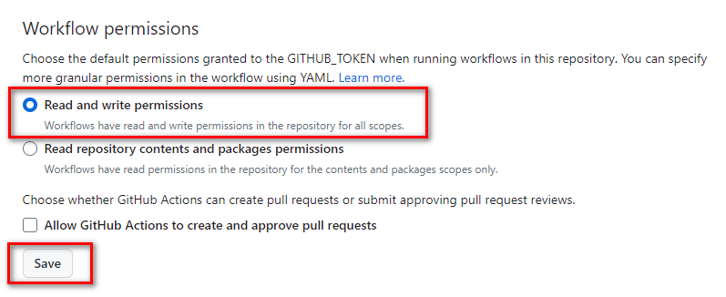
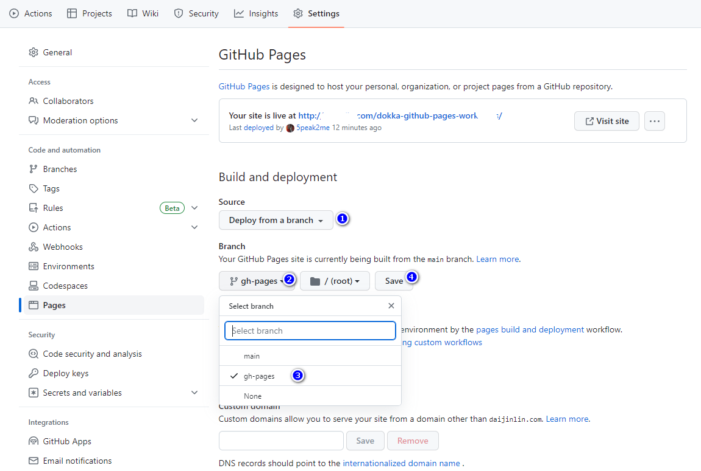

# dokka-github-pages-workflows

```shell
mkdir -p .github/workflows
```

```shell
touch documentation.yml
```

```yml
name: Documentation
on:
  push:
    tags:
      - 'v[0-9]+.[0-9]+.[0-9]+'

jobs:
  deploy:
    runs-on: macos-latest
    timeout-minutes: 60
    steps:
      - name: Checkout
        uses: actions/checkout@v3

      - name: Validate Gradle Wrapper
        uses: gradle/wrapper-validation-action@v1

      - name: Setup JDK 17
        uses: actions/setup-java@v3
        with:
          distribution: 'zulu'
          java-version: '17'

      - name: Run Dokka Task
        uses: gradle/gradle-build-action@v2
        with:
          cache-read-only: true
          arguments: dokkaHtmlMultiModule

      - name: Deploy Documentations
        uses: JamesIves/github-pages-deploy-action@v4
        with:
          folder: build/dokka/htmlMultiModule
```

## Repository Settings

change workflow permissions




```console
git tag -a v0.0.1 -m "release version 0.0.1"
```

```console
git push origin v0.0.1
```




## Using HTTPS 


# License

**dokka-github-pages-workflows** is distributed under the terms of the Apache License (Version 2.0). See the
[license](LICENSE) for more information.
